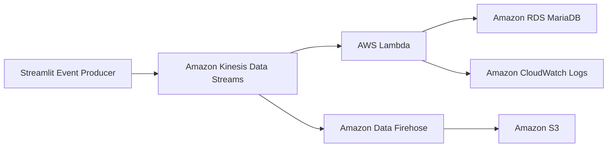

# Architecture



## Network

Lambda and RDS are deployed in the same VPC.

```text
VPC
├── Lambda
│   └── datastory_SG
│       └── TCP 3306
│
└── RDS MariaDB
    └── default Security Group
        └── inbound TCP 3306 from Lambda SG
```
