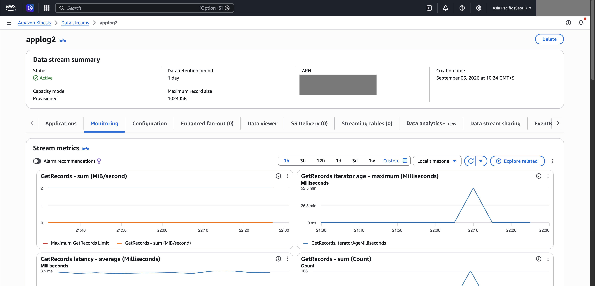
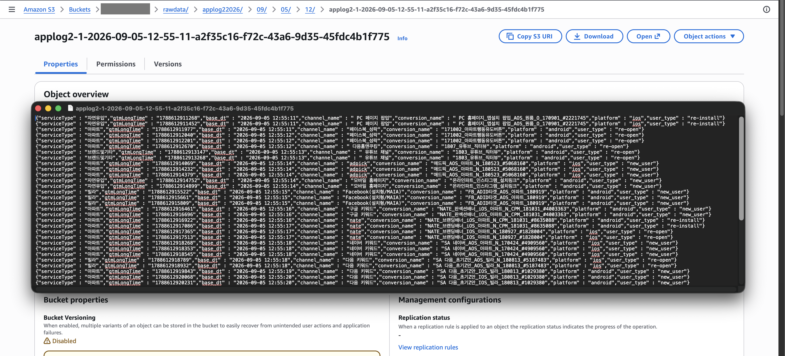
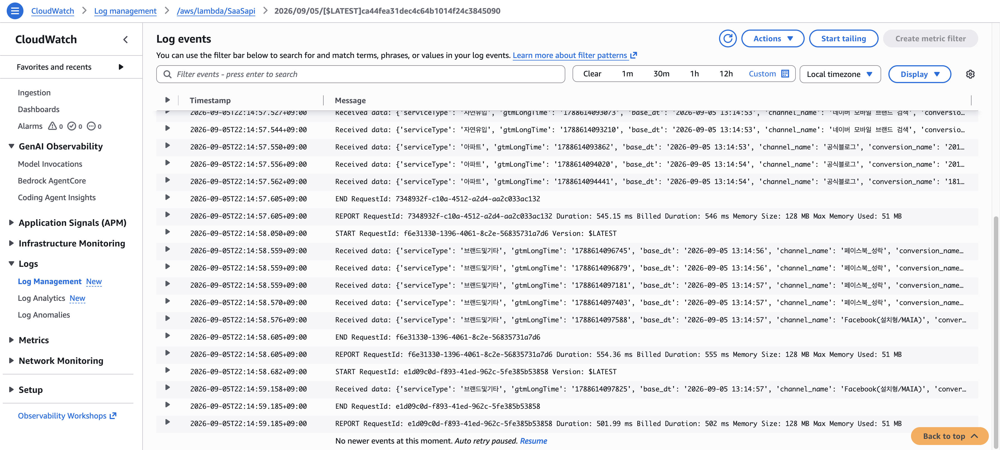
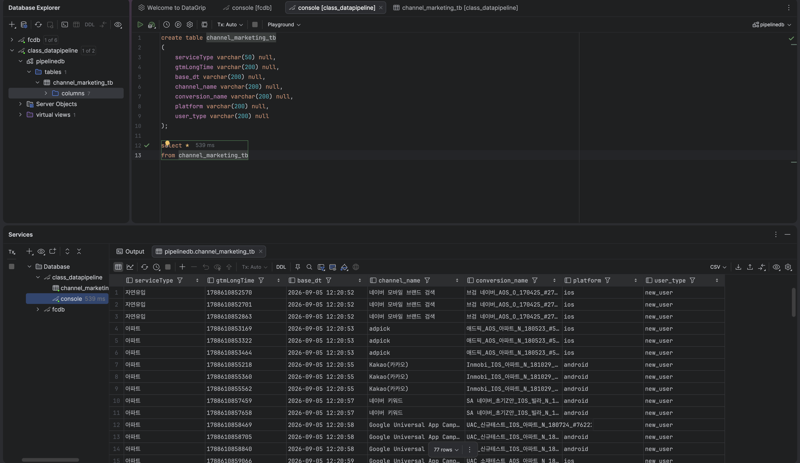

# AWS Real-Time Event Data Pipeline

> **End-to-end event ingestion and processing pipeline built with AWS Kinesis, Lambda, Firehose, S3, and RDS MariaDB**

## Project Overview

This project demonstrates an end-to-end **event-driven data pipeline** for collecting application event logs and routing them to both a raw data lake and a relational database.

Application events generated by a Streamlit producer are sent to **Amazon Kinesis Data Streams**. From Kinesis, the data follows two downstream paths:

- **Kinesis → Firehose → S3** for raw event storage
- **Kinesis → Lambda → RDS MariaDB** for filtered relational storage

The project also includes VPC networking, IAM permissions, Security Group configuration, CloudWatch monitoring, and troubleshooting of real deployment issues.

---

## Architecture

```text
                        Event Producer
                     Python / Streamlit
                              │
                              │ HTTP POST
                              ▼
                    ┌─────────────────────┐
                    │ Amazon Kinesis      │
                    │ Data Streams        │
                    └──────────┬──────────┘
                               │
                 ┌─────────────┴─────────────┐
                 │                           │
                 ▼                           ▼
       ┌──────────────────┐         ┌──────────────────┐
       │ AWS Lambda       │         │ Amazon Firehose  │
       │ Event Processing │         │ Data Delivery    │
       └────────┬─────────┘         └────────┬─────────┘
                │                            │
                ▼                            ▼
       ┌──────────────────┐         ┌──────────────────┐
       │ RDS MariaDB      │         │ Amazon S3        │
       │ Filtered Events  │         │ Raw Event Data   │
       └──────────────────┘         └──────────────────┘
                │
                ▼
       channel_marketing_tb
```

### Network Architecture

```text
                    AWS VPC
                  172.31.0.0/16
                         │
              ┌──────────┴──────────┐
              │                     │
          Lambda                  RDS
       datastory_SG           default SG
              │                     │
              └──── TCP 3306 ──────┘
```

The Lambda function and RDS instance were placed in the same VPC. The RDS Security Group allows inbound MySQL traffic on TCP port 3306 from the Lambda Security Group.

---

## Objectives

- Build a real-time event ingestion pipeline on AWS.
- Stream application events with Amazon Kinesis Data Streams.
- Store raw event data in Amazon S3 using Firehose.
- Process streaming records with AWS Lambda.
- Filter events based on `user_type`.
- Load selected events into MariaDB.
- Configure Lambda-to-RDS networking with VPC and Security Groups.
- Diagnose and resolve real AWS deployment issues.
- Validate the pipeline end to end.

---

## Tech Stack

| Area | Technology |
|---|---|
| Event Producer | Python, Streamlit |
| Streaming | Amazon Kinesis Data Streams |
| Serverless Processing | AWS Lambda |
| Object Storage | Amazon S3 |
| Data Delivery | Amazon Data Firehose |
| Relational Database | Amazon RDS for MariaDB |
| Monitoring | Amazon CloudWatch |
| Networking | Amazon VPC, Security Groups |
| Identity & Access | AWS IAM |
| Database Client | DataGrip |
| Languages | Python, SQL |

---

## Data Flow

### 1. Event Generation

A Streamlit application generates application event data and sends it as an HTTP POST request.

Example event structure:

```json
{
  "serviceType": "아파트",
  "gtmLongTime": 1788610859603,
  "base_dt": "2026-09-05 12:20:59",
  "channel_name": "다음 키워드",
  "conversion_name": "conversion_name",
  "platform": "android",
  "user_type": "new_user"
}
```

### 2. Kinesis Data Streams

The event is ingested into an Amazon Kinesis Data Stream.

Kinesis acts as the streaming layer and allows multiple downstream consumers to process the same event stream independently.

### 3. Raw Data Storage

One downstream path delivers the stream through Amazon Data Firehose into Amazon S3.

```text
Kinesis → Firehose → S3
```

The raw event data is stored under a date-based object path.

### 4. Lambda Processing

A Kinesis event source mapping invokes AWS Lambda.

Lambda:

1. Receives Kinesis records.
2. Base64-decodes the payload.
3. Parses the JSON event.
4. Checks `user_type`.
5. Inserts matching records into MariaDB.
6. Commits the transaction.
7. Closes the database connection.

Current filtering logic:

```python
if data.get("user_type") == "new_user":
    # insert into MariaDB
```

### 5. MariaDB Loading

Filtered events are stored in:

```text
pipelinedb
└── channel_marketing_tb
```

Table fields:

```text
serviceType
gtmLongTime
base_dt
channel_name
conversion_name
platform
user_type
```

---

## Key Engineering Challenges

### Challenge 1 — Secure MariaDB Connection

The initial DataGrip connection failed because the MariaDB instance required secure transport.

**Resolution:** configured SSL/TLS in DataGrip and successfully verified database connectivity.

---

### Challenge 2 — Existing Kinesis Event Source Mapping

While adding the Kinesis trigger to Lambda, AWS reported that an event source mapping already existed.

**Resolution:** identified the existing Kinesis → Lambda event source mapping instead of creating a duplicate.

---

### Challenge 3 — Lambda Timeout

The Lambda function initially timed out after 3 seconds.

CloudWatch showed timeout reports without the expected application-level output.

This indicated that the function was likely waiting during database connection rather than failing during Kinesis payload parsing.

**Resolution:** increased the Lambda timeout during troubleshooting and investigated the network path between Lambda and RDS.

---

### Challenge 4 — Lambda VPC Permissions

When connecting Lambda to the VPC, AWS returned an error because the Lambda execution role did not have permission to create network interfaces.

**Resolution:** attached:

```text
AWSLambdaVPCAccessExecutionRole
```

to the Lambda execution role.

---

### Challenge 5 — Security Group Access

The RDS Security Group initially allowed the development machine's IP address but did not allow the Lambda Security Group to access MariaDB.

**Resolution:** added an inbound rule:

```text
Type:     MySQL/Aurora
Protocol: TCP
Port:     3306
Source:   Lambda Security Group
```

After the network configuration was corrected, Lambda successfully connected to RDS and inserted data into MariaDB.

---

## End-to-End Validation

The completed pipeline was verified through each major stage:

| Pipeline Stage | Result |
|---|---|
| Streamlit event generation | ✅ |
| Kinesis ingestion | ✅ |
| Firehose delivery | ✅ |
| Raw data stored in S3 | ✅ |
| Kinesis → Lambda trigger | ✅ |
| Lambda processing | ✅ |
| Lambda → RDS connection | ✅ |
| MariaDB INSERT | ✅ |
| Data visible in DataGrip | ✅ |

Validation query:

```sql
SELECT *
FROM channel_marketing_tb;
```

The resulting records confirmed successful delivery into MariaDB.

---

## Security Considerations

No credentials are included in this repository.

The Lambda source code uses environment variables for database configuration:

```python
db_config = {
    "user": os.environ["DB_USER"],
    "password": os.environ["DB_PASSWORD"],
    "host": os.environ["DB_HOST"],
    "database": os.environ["DB_NAME"],
}
```

For a production deployment, AWS Secrets Manager would be preferable for database credentials.

---

## Pipeline Evidence

### 1. Kinesis Data Stream

The application events were successfully ingested into Amazon Kinesis Data Streams.



### 2. Raw Data in Amazon S3

The streaming events were delivered to Amazon S3 through Amazon Data Firehose.



### 3. Lambda Event Processing

AWS Lambda successfully received and processed Kinesis records.



### 4. Data Loaded into MariaDB

Filtered events were successfully inserted into the RDS MariaDB table.



---

## Key Learnings

This project provided practical experience with:

- Event-driven architecture
- Real-time streaming with Kinesis
- Serverless event processing with Lambda
- Data lake ingestion with S3
- Firehose delivery
- Relational database loading
- VPC networking
- Security Group design
- IAM execution roles
- CloudWatch troubleshooting
- Python event processing
- SQL
- End-to-end pipeline validation

---

## Future Improvements

- Store database credentials in AWS Secrets Manager.
- Add structured logging and exception handling.
- Add retry/dead-letter handling for failed records.
- Batch database inserts for higher throughput.
- Add schema and data-quality validation.
- Add CloudWatch metrics and alarms.
- Provision infrastructure using Terraform or AWS SAM.
- Add CI/CD for Lambda deployment.

